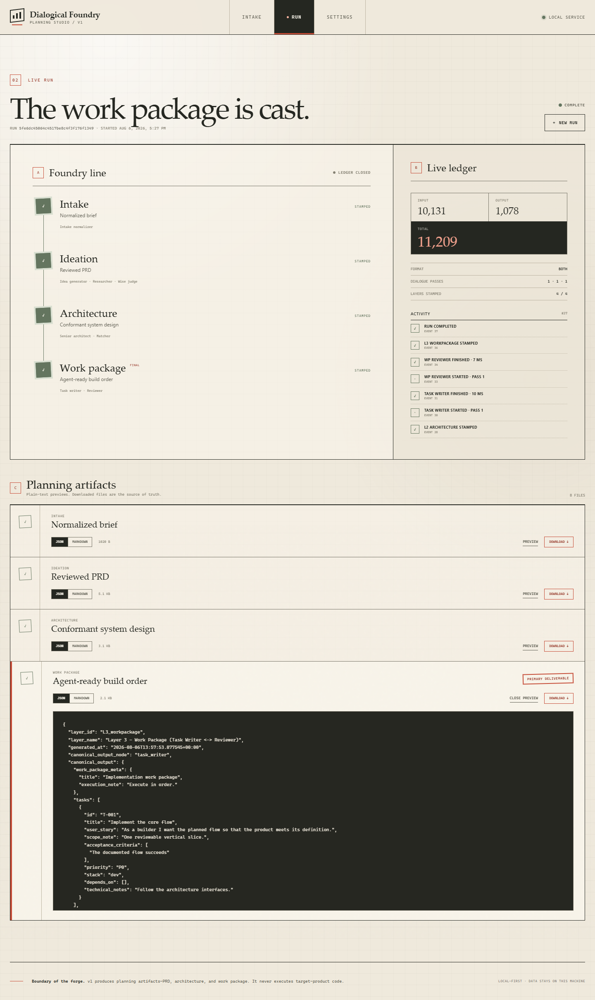
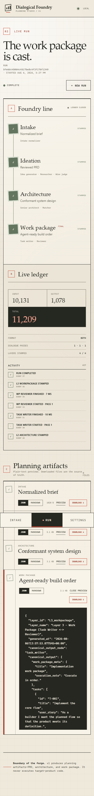

# Dialogical Foundry

> Give it a rough idea. Specialized models discuss, research, challenge, and refine it into a development-ready work package.

Dialogical Foundry is a local-first, single-page planning studio. It runs a visible graph of model roles over four layers and produces a normalized brief, product definition, architecture, and ordered user stories that can be handed to Codex, Claude Code, or another development agent.

The v1 boundary is deliberate: Foundry plans the target product; it does **not** implement or execute that product's code.

## What works

- Locked L0-L3 pipeline with configurable 4/2/2 dialogue loops.
- Mock provider for a complete offline, zero-key demonstration.
- Anthropic, OpenAI, and Gemini adapters with independent per-node models, Base URLs, and key references.
- Provider-native Deep Research for the Researcher node, with durable background-job resume and explicit report normalization.
- OpenAI/no-`top_k` creativity-prompt fallback.
- Mock or Tavily web research for the Researcher node.
- Structured JSON validation and retry; deterministic JSON and Markdown outputs.
- Exact, atomic checkpoints with persisted sessions, iteration history, token totals, and resume cursor.
- Confirmed deletion of inactive runs from the archive or run detail view, including persisted events and files.
- FastAPI REST API, replayable SSE progress, SQLite metadata/config, and filesystem outputs.
- Encrypted local keystore whose secret values are write-only through the API.
- Responsive React SPA with Intake, Run, and Settings views.
- Local production build, Docker Compose, unit/integration tests, and an offline end-to-end path.

## Pipeline

```text
L0 Intake        intake
L1 Ideation      (idea_generator -> researcher -> judge) x4 -> judge_finalize / PRD
L2 Architecture  (architect -> matcher) x2
L3 Work Package  (task_writer -> wp_reviewer) x2 -> final deliverable
```

Each node has its own replayed message session within its home layer. Every iteration is retained, while normal feedback edges read the latest critic result. `judge_finalize` receives the complete ideation/research/judge history.

## Interface preview

| Desktop run ledger | Mobile run ledger |
| --- | --- |
|  |  |

## Quick start — production-style local app

Requirements: Python 3.12, Node.js 20+ and [uv](https://docs.astral.sh/uv/). On Windows PowerShell, use `npm.cmd` if script execution blocks `npm.ps1`.

```powershell
uv sync --extra dev
Set-Location frontend
npm.cmd ci
npm.cmd run build
Set-Location ..
uv run foundry
```

Open <http://127.0.0.1:8000>. Select the default `mock` configuration and run the walkthrough without any API key.

Data is written to `./data` by default. Set `FOUNDRY_DATA_DIR` before launch to use another location. Native runs load the root `.env` without overriding existing process variables.

## Development mode

Terminal 1:

```powershell
uv run uvicorn server.main:app --reload --host 127.0.0.1 --port 8000
```

Terminal 2:

```powershell
Set-Location frontend
npm.cmd run dev
```

Open <http://127.0.0.1:5173>. Vite proxies `/api` to FastAPI.

On PowerShell you can also run `./scripts/dev.ps1`, which starts the API in the background and keeps the frontend terminal attached.

## Docker

Start the built SPA and API as one non-root service:

```console
docker compose up --build
```

Open <http://127.0.0.1:8000>. The named `foundry-data` volume persists the database, master key, checkpoints, inputs, and outputs. Stop with `docker compose down`; add `-v` only when you intentionally want to delete all persisted Foundry data.

## Configure real providers

1. Open **Settings → Local keys** and save an Anthropic, OpenAI, Gemini, or Tavily key. Saved values are never returned to the browser; only label, provider, and fingerprint are listed.
2. Expand a node, select its provider/model/key reference, optionally set its Base URL, tune sampling, and save it. OpenAI nodes can independently use Chat Completions or streamed Responses. The model ID is sent exactly as entered.
3. Select Tavily in **Search & defaults**, choose the Tavily key, and save defaults.
4. Start a new run. Configuration is resolved when the run begins.

The default is deliberately mock-first. Anthropic supports `top_k`; OpenAI does not, so the Idea Generator automatically switches to its prompt-level creativity fallback while retaining supported entropy parameters.

OpenAI, Anthropic, and Gemini calls use a 30-minute response timeout per attempt by default.
Override it with `FOUNDRY_LLM_TIMEOUT_SECONDS`. Custom gateways can be selected
with provider environment variables in the root `.env`:

```dotenv
FOUNDRY_LLM_TIMEOUT_SECONDS=1800
OPENAI_BASE_URL=http://127.0.0.1:11434/v1
FOUNDRY_OPENAI_COMPAT_USER_AGENT=curl/8.0
# ANTHROPIC_BASE_URL=https://anthropic-gateway.example.com
# GEMINI_BASE_URL=https://generativelanguage.googleapis.com/v1beta
```

For a gateway running on the host while Foundry runs in Docker, replace
`127.0.0.1` with `host.docker.internal`. See [configuration and providers](docs/CONFIGURATION.md).

Use an API root for OpenAI-compatible Base URLs, not a final operation path. Foundry also safely normalizes accidentally pasted trailing `/chat/completions` or `/responses` paths. Choose **Responses API · streamed** for Responses-compatible gateways such as coding-agent relays: the connection receives SSE events while the model works, and Foundry assembles and validates the final JSON. Choose **Chat Completions** for gateways that only implement `/chat/completions`. Official OpenAI reasoning-family Chat Completions automatically use `max_completion_tokens` and omit unsupported sampling fields; compatible gateways retain the conventional `max_tokens` request and receive the configurable compatibility User-Agent.

### Deep Research

Only the **Researcher** node exposes `deep_research` mode. Choose one of these real providers, enter the exact research model/agent ID, and enter a separate exact standard-model ID for normalization:

- OpenAI: Responses API in background mode with `web_search_preview`.
- Gemini: Interactions API with the entered value sent as the `agent` ID.
- Anthropic: Messages API with the server-side `web_search_20250305` tool.

OpenAI's dedicated research model is not GPT-4.1: GPT-4.1 can be used as the normalizer (or as an optional prompt-refinement model outside this app), while the research request itself needs a Deep Research model ID supported by the account. Gemini Deep Research likewise expects an agent ID, not a standard Gemini model ID.

The research timeout defaults to 1,800 seconds and is independently configurable on the Researcher row. OpenAI and Gemini job IDs are checkpointed before polling, so Resume continues the same remote job instead of creating another billed job. The raw cited report is retained in checkpoint history and normalized into the Researcher JSON contract. Deep Research runs once per ideation pass; the default four passes can therefore create four paid research jobs.

## Outputs and recovery

Each run lives at:

```text
data/runs/<run-id>/
  input/manifest.json
  input/files/...
  state.json
  outputs/L0_intake.{json,md}
  outputs/L1_ideation.{json,md}
  outputs/L2_architecture.{json,md}
  outputs/L3_workpackage.{json,md}
```

`state.json` is replaced atomically after every validated node and immediately after a provider creates a background research job. It records the next action cursor, sessions, append-only artifacts, tokens, retry history, completed layers, and any pending remote job ID, but never secret values. If the process exits during a run, startup marks it interrupted and the Run view offers Resume. Completed actions and checkpointed remote job creation are not repeated.

To remove an old run, open **Run archive** or the run detail page and choose **Delete**. Foundry asks for confirmation, refuses deletion while the run is active, and then permanently removes the run record, event history, inputs, checkpoints, raw reports, and outputs. Saved provider keys are not affected.

## CLI engine

The engine remains usable without the web app:

```console
uv run python run.py pipelines/foundry_v1.json --format both --brief "Your idea"
```

CLI output defaults to `runs/`, which is ignored by Git.

## Tests and checks

```powershell
uv sync --extra dev
uv run pytest
uv run ruff check engine server tests run.py
Set-Location frontend
npm.cmd ci
npm.cmd run test
npm.cmd run build
```

The backend suite covers pipeline shape, structured outputs, token accounting, creativity fallback, validation retry, exact local and remote-job resume, exact model/Base URL request routing for all real providers, run APIs, SSE replay, safe downloads, settings, intake limits, and write-only keys. Real paid-provider calls remain opt-in; automated tests use protocol-level fakes and never bill an API.

## Input and security limits

- Brief: at most 2,000 whitespace-delimited words, enforced in UI and API.
- Pasted text: 100,000 characters.
- Uploads: five files, 2 MiB each, 8 MiB combined; UTF-8 text/code formats and PDFs.
- GitHub: canonical public `https://github.com/owner/repo` URLs only; bounded files and extracted characters, fixed GitHub hosts, no redirect following.
- Keys are encrypted with Fernet using `data/.master-key` (or `FOUNDRY_MASTER_KEY`). The master key is outside SQLite and excluded from Git.
- The server binds to `127.0.0.1` by default, applies restrictive browser headers, treats imported content as untrusted, and never renders model output as HTML.

This is a local single-user security model, not a remote multi-tenant secret vault. Read [data and security](docs/DATA_AND_SECURITY.md) before exposing the service beyond localhost.

## Documentation

- [Walkthrough](docs/WALKTHROUGH.md)
- [Architecture](docs/ARCHITECTURE.md)
- [API reference](docs/API.md)
- [Configuration and providers](docs/CONFIGURATION.md)
- [Data and security](docs/DATA_AND_SECURITY.md)
- [Development and testing](docs/DEVELOPMENT.md)
- [Locked v1 specification](SPEC.md)
- [Node prompts](PROMPTS.md)
- [Implementation plan](IMPLEMENTATION_PLAN.md)

## Troubleshooting

- **`npm.ps1` cannot be loaded:** use `npm.cmd` in PowerShell.
- **Frontend landing page says it is not built:** run `npm.cmd ci && npm.cmd run build` inside `frontend/`, then restart FastAPI.
- **A real node says its key is missing:** add the key in Settings and assign its reference to that node.
- **An OpenAI-compatible coding gateway returns Cloudflare `524`:** select **Responses API · streamed** on that node when the gateway implements `/responses`. The 30-minute Foundry timeout cannot extend an upstream reverse-proxy timeout for a silent non-streaming request.
- **Tavily is selected but not configured:** save a Tavily key and select it under Search & defaults, or switch search back to mock.
- **Docker cannot connect:** start Docker Desktop/daemon before `docker compose up --build`.
- **Run stopped after a restart:** open the run and choose Resume; inspect the visible error and `data/runs/<id>/state.json` if recovery is refused.
